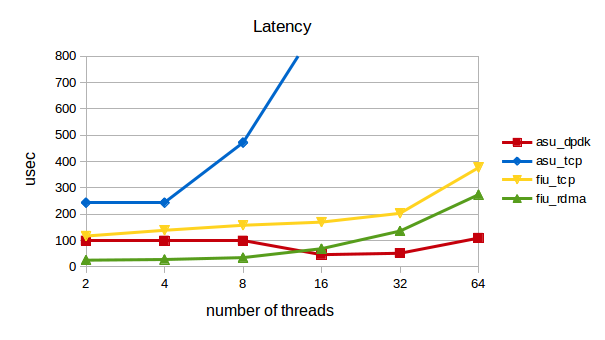
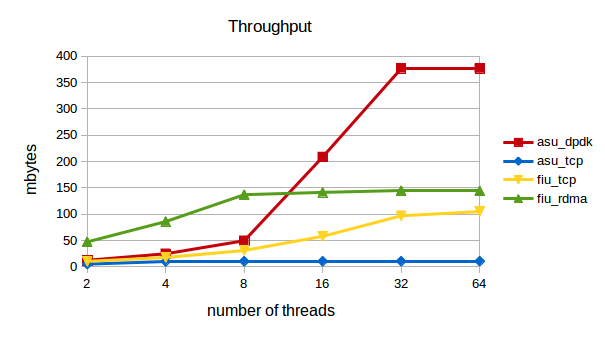
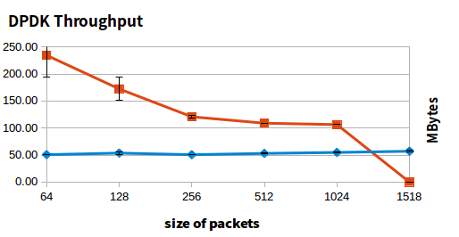
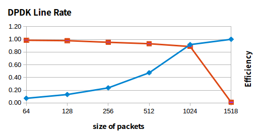

# DPDK Experiment

### Prerequisites
- [Network Dictionary](https://docs.google.com/document/d/1ovVb2subuS-UQl161BGVeXlWYFnu6jngM4QcB81HNpw/edit?usp=sharing)
- [DPDK Dictionary](https://docs.google.com/document/d/1sOiMM1qw4DNYUfDTZYZ2L_ZUbv6R7lVD48AmClV51Mo/edit?usp=sharing)

 

### Common Features
- [`helloworld` - allocating the pthreads for each logical cores](helloworld)
- [`skeleton` - basic concpet of tranferring packets](skeleton)
- [`l2fwd` - basic concpet of l2 packet forwarding](l2fwd)
- [`crafting Packets` - experiment on creating packets](pkt-craft)
- [`dpdk packets` - experiment on packet components ](packet-experiment)
- [`ring` - experiment on ring ](ring-experiment)
- [`device reading` - getting device configuration data from ceph](device)

 

### Performance Test
- [Implemented pingpong for DPDK](pingpong-experiment)
- [Implemented pingpong for TCP](tcp-experiment)
- [Implemented pingpong for PKTGEN](pktgen-experiment)
- [Comparing Official Performance Tests by Intel](Official_Performance_Test)
- [`Latency Performance Test` by using f-stack & IMB-benchmark](latency-experiment)
- [`Netperf Experiment` for integrating f-stack with the proper benchmark ](netperf-experiment)
- [Factors influencing network performance](factor-performance)

 

### Performance Result

- **dpdk vs tcp vs rdma using wrk benchmark**

 

- **dpdk vs tcp result based on customized pingpong**

