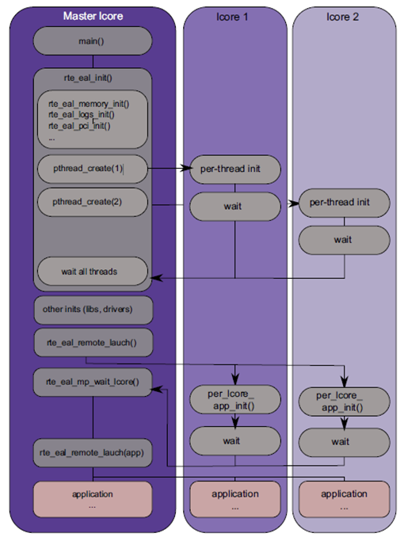

### HELLOWORLD



<br>

```c
int main(int argc, char **argv) {
	ret = rte_eal_init(argc, argv);
	if (ret < 0)
		rte_panic("Cannot init EAL\n");
```

> get the data for logical cores and memory <br>
> initialize the Environment Abstraction Layer (EAL)

<br>

```c
	RTE_LCORE_FOREACH_SLAVE(lcore_id) {
		rte_eal_remote_launch(lcore_hello, NULL, lcore_id);
	}
```
> function for slave cores <br>
> arg1: function to be called <br>
> arg2: argument for the function <br>
> arg3: lcores

<br>

```c
	/* call it on master lcore too */
	lcore_hello(NULL);

	rte_eal_mp_wait_lcore();
	return 0;
}
```

> the lcore_hello function has the rte_lcore_id which will get the id <br>
> in this case all the lcores are invoked so the master core is the final one to be invoked <br>


<br>

```c
static int
lcore_hello(__attribute__((unused)) void *arg)
{
	unsigned lcore_id;
	lcore_id = rte_lcore_id();
	printf("hello from core %u\n", lcore_id);
	return 0;
}
```

> thread function of each cores


<br>

```
EAL: Detected 8 lcore(s)          
EAL: Probing VFIO support...      
===****Initial memory for socket 0
===****Initial memory for socket 0
===****Initial memory for socket 0
hello from core 1                 
hello from core 2                 
hello from core 3                 
hello from core 4                 
hello from core 5                 
hello from core 6                 
hello from core 7                 
hello from core 0                
```

> the master core id is always zero and initiated at the very last
